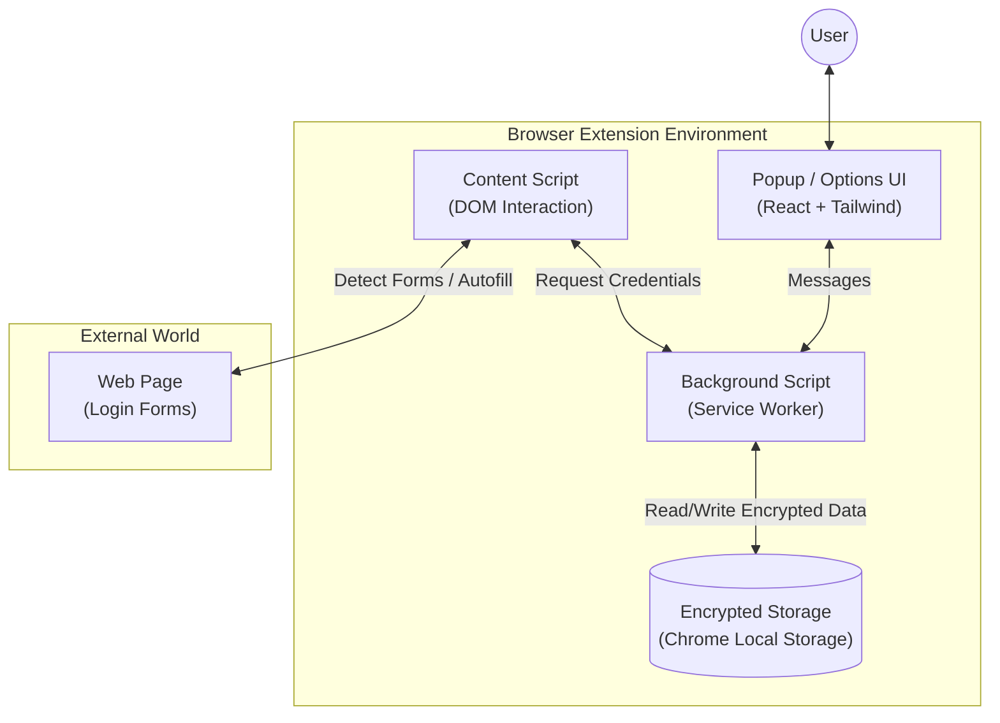
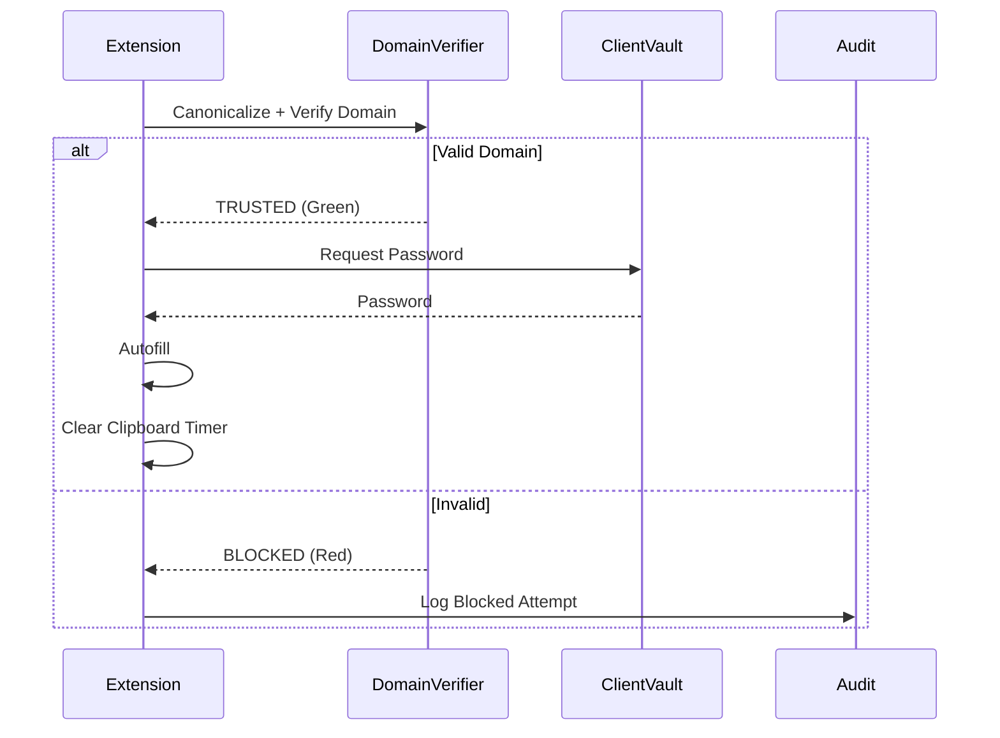

# ZeroVault: Zero-Knowledge Password Manager

<div align="center">
  
  <h1>ZeroVault</h1>
  <p><strong>The Secure, Local-First, Zero-Knowledge Password Manager for Your Browser.</strong></p>

  [](https://opensource.org/licenses/MIT)
  [](https://react.dev/)
  [](https://www.typescriptlang.org/)
  [](https://vitejs.dev/)
  [](https://tailwindcss.com/)
  [](https://en.wikipedia.org/wiki/Zero-knowledge_proof)
</div>

---

## 📋 Table of Contents

- [Introduction](#-introduction)
- [Architecture](#%EF%B8%8F-architecture)
- [Security](#%EF%B8%8F-security)
- [Features](#-features)
- [Tech Stack](#%EF%B8%8F-tech-stack)
- [Getting Started](#-getting-started)
- [Project Structure](#-project-structure)
- [Contributing](#-contributing)
- [License](#-license)

## 📖 Introduction

**ZeroVault** is a modern browser extension engineered to provide top-tier security without compromising on user experience. Unlike traditional password managers that store your data on centralized servers, ZeroVault adopts a **Local-First** and **Zero-Knowledge** architecture.

Your passwords are encrypted **on your device** using your master password. We never see your password, your keys, or your data. You are the only one who holds the keys to your digital vault.

## 🏗️ Architecture

ZeroVault operates entirely within your browser environment. The extension is composed of three main isolated contexts that communicate securely.



### Data Flow
1.  **Unlock**: User enters Master Password -> Key is derived in memory (Session).
2.  **Storage**: Credentials are encrypted with AES-GCM before saving to `chrome.storage.local`.
3.  **Autofill**: Content Script detects a login form -> Requests credentials from Background -> Background decrypts using Session Key -> Sends back to Content Script -> Autofill.

### Domain Verification Flow



## 🛡️ Security

ZeroVault uses industry-standard cryptographic primitives provided by the **Web Crypto API**.

### 1. Key Derivation (PBKDF2)
Your Master Password is never stored. Instead, we derive a cryptographic key from it using **PBKDF2** (Password-Based Key Derivation Function 2) with a unique salt for each user.

```typescript
// src/utils/crypto.ts
export const deriveMasterKey = async (password: string, salt: string): Promise<string> => {
    const enc = new TextEncoder();
    const keyMaterial = await crypto.subtle.importKey(
        "raw",
        enc.encode(password),
        { name: "PBKDF2" },
        false,
        ["deriveBits", "deriveKey"]
    );

    const key = await crypto.subtle.deriveKey(
        {
            name: "PBKDF2",
            salt: Uint8Array.from(atob(salt), c => c.charCodeAt(0)),
            iterations: 100000, // High iteration count for security
            hash: "SHA-256"
        },
        keyMaterial,
        { name: "AES-GCM", length: 256 },
        true,
        ["encrypt", "decrypt"]
    );
    // ... export key as JWK
};
```

### 2. Encryption (AES-GCM)
All vault data is encrypted using **AES-GCM** (Advanced Encryption Standard - Galois/Counter Mode) with a 256-bit key. GCM mode provides both confidentiality and data integrity (authentication).

## ✨ Features

-   🔐 **Zero-Knowledge Encryption**: Your data is encrypted before it leaves your input field.
-   📝 **Credential Management**: Create, Read, Update, and Delete login credentials.
-   ⚡ **Smart Autofill**: Automatically detects login forms and offers to fill them securely.
-   🎨 **Modern UI**: A beautiful, dark-mode enabled interface built with **Shadcn UI** principles.
-   🛡️ **Security Dashboard**: Analyzes password strength and reuse to keep you safe.
-   🎲 **Password Generator**: Built-in CSPRNG password generator.
-   ⏱️ **Auto-Lock**: Automatically locks the vault after a period of inactivity.
-   🔄 **Sync Ready**: Architecture designed to support encrypted sync (Mock implementation included).

## 🛠️ Tech Stack

| Category | Technology | Purpose |
|----------|------------|---------|
| **Core** | [React 19](https://react.dev/) | UI Library |
| **Language** | [TypeScript](https://www.typescriptlang.org/) | Type Safety |
| **Build Tool** | [Vite](https://vitejs.dev/) | Fast Bundling |
| **Extension** | [CRXJS](https://crxjs.dev/vite-plugin) | Vite Plugin for Chrome Extensions |
| **Styling** | [TailwindCSS](https://tailwindcss.com/) | Utility-First Styling |
| **State** | [Zustand](https://zustand-demo.pmnd.rs/) | Global State Management |
| **Routing** | [React Router](https://reactrouter.com/) | View Navigation |
| **Icons** | [Lucide React](https://lucide.dev/) | Consistent Iconography |
| **Crypto** | [Web Crypto API](https://developer.mozilla.org/en-US/docs/Web/API/Web_Crypto_API) | Native Browser Security |


## 🧪 Testing & Quality Assurance

ZeroVault maintains high code quality standards through a comprehensive unit testing suite powered by **Vitest** and **React Testing Library**.

### Testing Strategy

-   **Unit Tests**: Verify the logic of individual functions, hooks, and utilities (e.g., `crypto.ts`, `formDetector.ts`).
-   **Component Tests**: Ensure UI components render correctly and interact as expected (e.g., `VaultHome.tsx`, `PasswordGenerator.tsx`).
-   **Integration Tests**: Validate the interaction between stores and services (e.g., `VaultStore` with `chrome.storage`).

### Running Tests

To execute the test suite, use the following commands:

```bash
# Run all tests once
npm test

# Run tests in watch mode (interactive)
npm run test:watch

# Generate code coverage report
npm run test:coverage
```

### Coverage Goals

We aim for high test coverage across critical paths, particularly in:
-   **Cryptography Modules**: Ensuring key derivation and encryption/decryption are flawless.
-   **Vault Operations**: Verifying CRUD actions and data integrity.
-   **Authentication Flow**: guaranteeing secure unlock and locking mechanisms.

---

## 🚀 Getting Started

### Prerequisites
-   Node.js (v18 or higher)
-   npm (v9 or higher)

### Installation

1.  **Clone the Repository**
    ```bash
    git clone https://github.com/yourusername/zerovault.git
    cd zerovault
    ```

2.  **Install Dependencies**
    ```bash
    npm install
    ```

3.  **Build the Project**
    ```bash
    npm run build
    ```
    This will generate a `dist` folder containing the compiled extension.

### Loading into Chrome / Edge / Brave

1.  Open your browser and navigate to `chrome://extensions`.
2.  Toggle **Developer Mode** in the top right corner.
3.  Click **Load unpacked**.
4.  Select the `dist` folder from your project directory.
5.  ZeroVault is now installed! Pin it to your toolbar for easy access.

### Development Mode
To run in watch mode with Hot Module Replacement (HMR):
```bash
npm run dev
```

## 📂 Project Structure

```
src/
├── components/         # Reusable UI components (Buttons, Inputs, Modals)
├── extension/          # Extension-specific entry points
│   ├── background/     # Service Worker (encryption, storage handling)
│   ├── contentScript/  # DOM injection (autofill, form detection)
│   └── popup/          # Main extension UI entry
├── hooks/              # Custom React hooks (useToast, etc.)
├── pages/              # Application Views
│   ├── auth/           # Login, Register, Welcome screens
│   ├── generator/      # Password Generator view
│   ├── settings/       # Settings & subpages
│   └── vault/          # Main Vault Dashboard
├── services/           # Business logic services (Storage, Sync)
├── store/              # Zustand state stores (AuthStore, VaultStore)
└── utils/              # Core utilities (Crypto, Types, URL Matching)
```

## 🤝 Contributing

Contributions are welcome! Please feel free to submit a Pull Request.

1.  Fork the project.
2.  Create your feature branch (`git checkout -b feature/AmazingFeature`).
3.  Commit your changes (`git commit -m 'Add some AmazingFeature'`).
4.  Push to the branch (`git push origin feature/AmazingFeature`).
5.  Open a Pull Request.

## 📄 License

Distributed under the MIT License. See `LICENSE` for more information.

---

<div align="center">
  <sub>Built with ❤️ by the ZeroVault Team.</sub>
</div>
