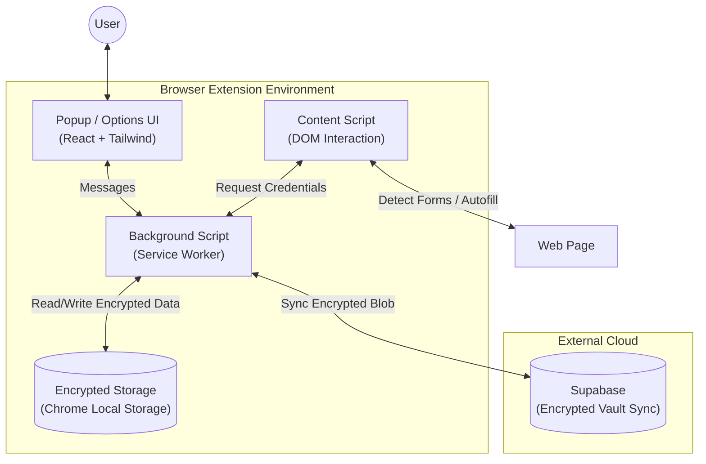

# ZeroVault: Zero-Knowledge Password Manager

<div align="center">
  
  <h1>ZeroVault</h1>
  <p><strong>The Secure, Local-First, Zero-Knowledge Password Manager for Your Browser.</strong></p>

  [](https://opensource.org/licenses/MIT)
  [](https://react.dev/)
  [](https://www.typescriptlang.org/)
  [](https://vitejs.dev/)
  [](https://tailwindcss.com/)
  [](https://en.wikipedia.org/wiki/Zero-knowledge_proof)
</div>

---

## 📋 Table of Contents

- [Introduction](#-introduction)
- [Project Flow](#-project-flow)
- [Architecture](#%EF%B8%8F-architecture)
- [Security](#%EF%B8%8F-security)
- [Features](#-features)
- [Tech Stack](#%EF%B8%8F-tech-stack)
- [Getting Started](#-getting-started)
- [Project Structure](#-project-structure)
- [License](#-license)

## 📖 Introduction

**ZeroVault** is a high-security browser extension designed to provide a seamless password management experience without compromising user privacy. It leverages a **Zero-Knowledge** architecture, ensuring that sensitive data (passwords, notes, etc.) is always encrypted on the client side before being persisted or synced.

The master password never leaves the browser. Key derivation and encryption/decryption are handled entirely locally using the native **Web Crypto API**.

## 🔄 Project Flow

ZeroVault manages the entire lifecycle of your credentials:

1.  **Onboarding**: User creates an account (Supabase) and a Master Password.
2.  **Vault Initialization**: A unique salt is generated, and a master key is derived (PBKDF2). This key is used to create an initial encrypted vault.
3.  **Credential Management**: Users add credentials through the UI or via automatic form detection.
4.  **Secure Storage**: Credentials are encrypted (AES-GCM) and saved to `chrome.storage.local`.
5.  **Autofill**: When a login form is detected, the content script requests credentials. If the vault is unlocked, the background script decrypts the relevant entry and injects it into the form.
6.  **Sync**: The encrypted vault is synchronized with Supabase, allowing for multi-device access while maintaining zero-knowledge integrity.

## 🏗️ Architecture

The extension consists of three isolated contexts communicating via message passing:


```mermaid
graph TD
    subgraph "Browser Extension Environment"
        UI["Popup / Options UI\n(React + Tailwind)"]
        BG["Background Script\n(Service Worker)"]
        CS["Content Script\n(DOM Interaction)"]
        Vault[("Encrypted Storage\n(Chrome Local Storage)")]
    end

    subgraph "External Cloud"
        DB[("Supabase\n(Encrypted Vault Sync)")]
    end

    User(("User")) <--> UI
    UI <-->|Messages| BG
    BG <-->|Read/Write Encrypted Data| Vault
    BG <-->|Sync Encrypted Blob| DB
    CS <-->|Detect Forms / Autofill| Web["Web Page"]
    CS <-->|Request Credentials| BG
```

## 🛡️ Security

### Key Architecture Principles
*   **Zero-Knowledge**: The server only stores encrypted blobs. It never has access to the master password or plain-text data.
*   **PBKDF2 Derivation**: 100,000 iterations with a cryptographically secure random salt to prevent brute-force attacks.
*   **AES-256-GCM**: Industry-standard symmetric encryption for data-at-rest with built-in integrity checking.
*   **Volatile Session Keys**: The derived master key is stored only in `chrome.storage.session`, which is cleared when the browser closes or the vault is locked.

## ✨ Features

-   🔐 **Zero-Knowledge Encryption**: End-to-end security for all data.
-   ⚡ **Intelligent Autofill**: Advanced form detection with support for modern web frameworks (React, Vue, etc.).
-   🔄 **Encrypted Sync**: Secure bidirectional synchronization via Supabase.
-   🛡️ **Breach Monitoring**: Integration with HaveIBeenPwned API (using k-anonymity) to check for compromised passwords.
-   🖐️ **Biometric Support**: WebAuthn/FIDO2 integration for platform-native authentication (Fingerprint, FaceID).
-   🎨 **Premium UI**: Dark-mode primary design built with Tailwind CSS and Radix UI primitives.
-   🎲 **Strong Generator**: Custom password generator with configurable complexity.
-   ⏱️ **Auto-Lock**: Configurable security timer to clear session keys after inactivity.

## 🛠️ Tech Stack

| Category | Technology |
|----------|------------|
| **Core** | [React 19](https://react.dev/), [TypeScript](https://www.typescriptlang.org/) |
| **Styling** | [TailwindCSS](https://tailwindcss.com/), [Lucide Icons](https://lucide.dev/) |
| **State** | [Zustand](https://zustand-demo.pmnd.rs/) with Persistence |
| **Backend** | [Supabase](https://supabase.com/) (Auth & Storage) |
| **Crypto** | [Web Crypto API](https://developer.mozilla.org/en-US/docs/Web/API/Web_Crypto_API) |
| **Build Tool**| [Vite](https://vitejs.dev/) + [CRXJS](https://crxjs.dev/) |

## 🚀 Getting Started

### Installation

1.  **Clone the Repository**
    ```bash
    git clone https://github.com/arlagaddajagruthi/WebExtension_ZeroKnowledge.git
    cd WebExtension_ZeroKnowledge
    ```

2.  **Environment Setup**
    Create a `.env` file in the root with your Supabase credentials:
    ```env
    VITE_SUPABASE_URL=your_project_url
    VITE_SUPABASE_ANON_KEY=your_anon_key
    ```

3.  **Install & Build**
    ```bash
    npm install
    npm run build
    ```

4.  **Load Extension**
    - Open Chrome and go to `chrome://extensions`.
    - Enable **Developer Mode**.
    - Click **Load unpacked** and select the `dist` folder.

## 📂 Project Structure

```bash
src/
├── extension/          # Service Worker, Content Scripts, Entry Points
├── services/           # Core Logic (Auth, Sync, Breach Check, WebAuthn)
├── store/              # State Management (Zustand)
├── utils/              # Cryptography, Messaging, Form Detection, Types
├── components/         # Shadcn-based UI Components
├── pages/              # Application Views (Vault, Settings, Auth)
└── App.tsx             # Main Routing and Logic
```

## 📄 License

Distributed under the MIT License.

---
<div align="center">
  <sub>Modern Security. Zero Compromise.</sub>
</div>
